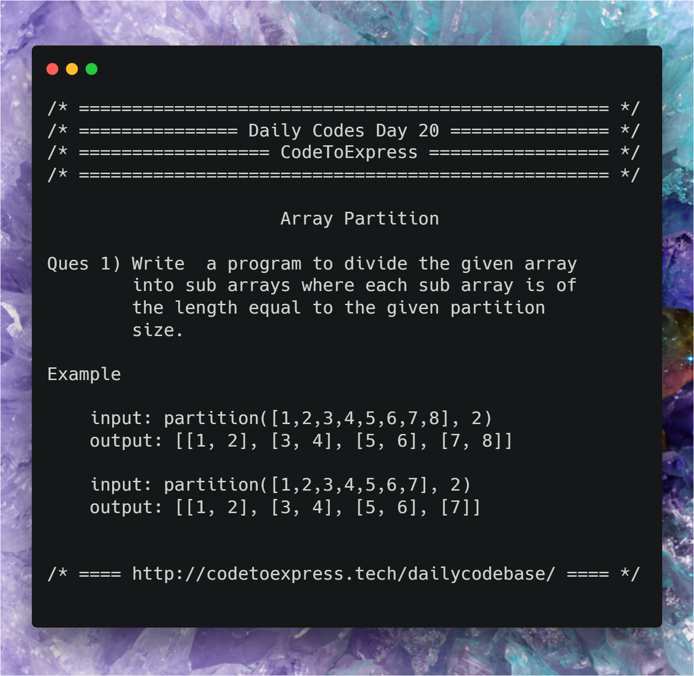

# Day 20 - Array Partition

Write a program to divide the given array into sub arrays where each sub array is of the length equal to the given partition size.

## Example

```
	input: partition([1,2,3,4,5,6,7,8], 2)
    output: [[1, 2], [3, 4], [5, 6], [7, 8]]
    
    input: partition([1,2,3,4,5,6,7], 2)
    output: [[1, 2], [3, 4], [5, 6], [7]]
```



## JavaScript Solution(s)

### [Solution 1](./JavaScript/sol1.js)

A very simple solution, all we have to is loop through i=0 to array length. In each iteration we check whether current iteration (i) is divisible by size or not, if it is not divisible, we add the current element in `toBeAdded` array otherwise we push the `toBeAdded` array into `partitionedArray`. Also, we check that `toBeAdded` is not wmpty otherwise it will push an empty array to `partitionedArray`


```js
function partition (array, size) {
    let partitionedArray = [],
        toBeAdded = [];

    for (let i=0; i<array.length; i++) {
        if ((i)%size === 0) {
            if (toBeAdded.length > 0)  partitionedArray.push (toBeAdded);
            toBeAdded = [];
        }
        toBeAdded.push (array[i]);
    }
    if (toBeAdded.length > 0)  partitionedArray.push (toBeAdded);
    return partitionedArray;
}
```

### [Solution 2](./JavaScript/sol2.js)

The second solution is also similar to the first one. Here, we create an empty array to hold partitions (let's call the array `partitionedArray`). Now for each element in the "original" array, we retrieve the  last element in partitionedArray . If the last element does not exist (in case of empty array), or if it's size is equal to the partition size, we push a new partition array into the `partitionedArray` with the current element. Otherwise, we add the current element into the partition.

```js
function partition (array, size) {
    let partitionedArray = [];

    for (let element of array) {
        let partition = partitionedArray[partitionedArray.length - 1];
        if (!partition || partition.length === size) {
            partitionedArray.push ([element]);
        } else {
            lastEle.push (element);
        }
    }

    return partitionedArray;
}
```

### [Solution 3](./JavaScript/sol3.js)

This method will use JavaScript's `slice` method. This is probably the easiest method due to the inbuilt function `slice`. 

#### How slice works

array.sllice (startIndex, endIndex); will return a subarray of array including elements from startIndex to endIndex (**not including endIndex**).

#### Steps

- Create an empty `partitionedArray` array
- run a while loop from index i=0 to less than "original" array.length
- Push a `slice` of length `size` from `array` to `partitionedArray`.
- `index = index+size`

```js
function partition (array, size) {
    let partitionedArray = [], i=0;
    while (i<array.length) {
        partitionedArray.push (array.slice(i, i+size));
        i += size;
    }
    return partitionedArray;
}
```